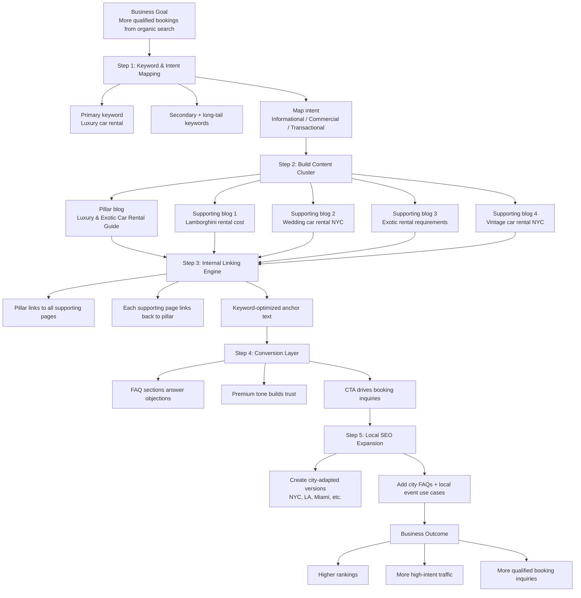

# Monaco Experiences SEO Strategy Flow Diagram

This diagram explains the strategy in a simple step-by-step flow.

## Plain-English Summary

1. We target what customers are actually searching for.
2. We publish one main guide and supporting topic pages.
3. We connect everything with internal links so Google sees topical authority.
4. We convert traffic with strong FAQs and booking CTAs.
5. We scale by adapting winning topics to more cities.
